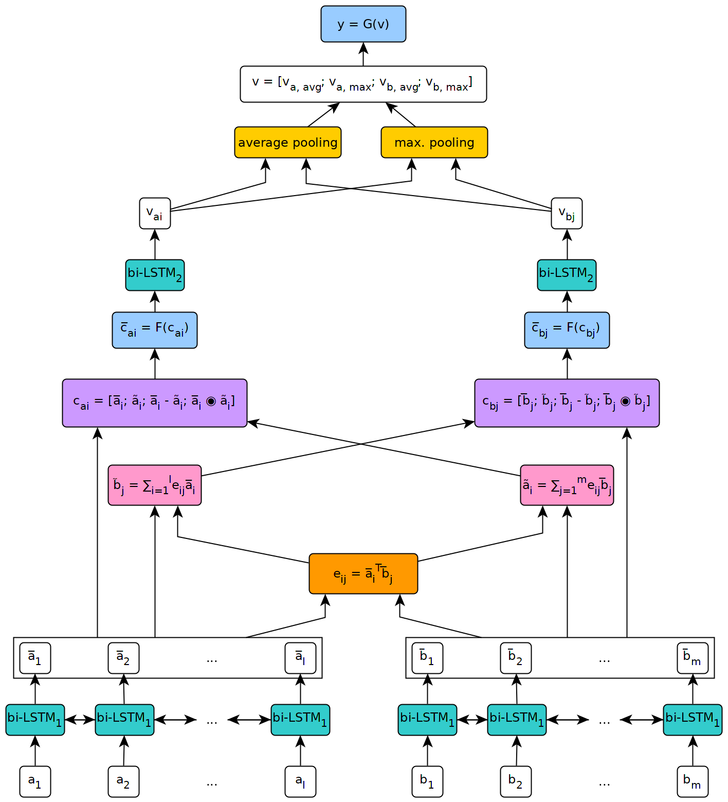

# ESIM - Enhanced Sequential Inference Model
Implementation of the ESIM model for natural language inference with PyTorch

This repository contains an implementation with PyTorch of the sequential model presented in the paper 
["Enhanced LSTM for Natural Language Inference"](https://arxiv.org/pdf/1609.06038.pdf) by Chen et al. in 2016.

The figure below illustrates a high-level view of the model's architecture.



This model was implemented in the context of [my master's thesis](https://coetaur0.github.io/projects/lean/) at the university of Geneva.

## How to
### Install the package
To use the model defined in this repository, you will first need to install PyTorch on your machine by following the steps
described on the package's [official page](https://pytorch.org/get-started/locally/) (this step is only necessary if you use
Windows).
Then, to install the dependencies necessary to run the model, simply execute the command `pip install --upgrade .` from within
the cloned repository (at the root, and preferably inside of a [virtual environment](https://docs.python.org/3/tutorial/venv.html)).

### Fetch the data to train and test the model
The *fetch_data.py* script located in the *scripts/* folder of this repository can be used to download some NLI dataset and
pretrained word embeddings. By default, the script fetches the [SNLI](https://nlp.stanford.edu/projects/snli/) corpus and
the [GloVe 840B 300d](https://nlp.stanford.edu/projects/glove/) embeddings. Other datasets can be downloaded by simply passing
their URL as argument to the script (for example, the [MultNLI dataset](https://www.nyu.edu/projects/bowman/multinli/)).

The script's usage is the following:
```
fetch_data.py [-h] [--dataset_url DATASET_URL]
              [--embeddings_url EMBEDDINGS_URL]
              [--target_dir TARGET_DIR]
```
where `target_dir` is the path to a directory where the downloaded data must be saved (defaults to *../data/*).

For MultiNLI, the matched and mismatched test sets need to be manually downloaded from Kaggle and the corresponding .txt files 
copied in the *multinli_1.0* dataset folder.

### Preprocess the data
Before the downloaded corpus and embeddings can be used in the ESIM model, they need to be preprocessed. This can be done with
the *preprocess_\*.py* scripts in the *scripts/preprocessing* folder of this repository. The *preprocess_snli.py* script can be 
used to preprocess SNLI, *preprocess_mnli.py* to preprocess MultiNLI, and *preprocess_bnli.py* to preprocess the Breaking NLI 
(BNLI) dataset. Note that when calling the script fot BNLI, the SNLI data should have been preprocessed first, so that the 
worddict produced for it can be used on BNLI.

The scripts' usage is the following (replace the \* with *snli*, *mnli* or *bnli*):
```
preprocess_*.py [-h] [--config CONFIG]
```
where `config` is the path to a configuration file defining the parameters to be used for preprocessing. Default 
configuration files can be found in the *config/preprocessing* folder of this repository.

### Train the model
The *train_\*.py* scripts in the *scripts/training* folder can be used to train the ESIM model on some training data and 
validate it on some validation data.

The script's usage is the following (replace the \* with *snli* or *mnli*):
```
train_*.py [-h] [--config CONFIG] [--checkpoint CHECKPOINT]
```
where `config` is a configuration file (default ones are located in the *config/training* folder), and `checkpoint` is an 
optional checkpoint from which training can be resumed. Checkpoints are created by the script after each training epoch, with 
the name *esim_\*.pth.tar*, where '\*' indicates the epoch's number.

### Test the model
The *test_\*.py* scripts in the *scripts/testing* folder can be used to test a pretrained ESIM model on some test data.

To test on SNLI, use the *test_snli.py* script as follows:
```
test_snli.py [-h] test_data checkpoint
```
where `test_data` is the path to some preprocessed test set, and `checkpoint` is the path to a checkpoint produced by the 
*train_snli.py* script (either one of the checkpoints created after the training epochs, or the best model seen during 
training, which is saved in *data/checkpoints/SNLI/best.pth.tar* - the difference between the *esim_\*.pth.tar* files and 
*best.pth.tar* is that the latter cannot be used to resume training, as it doesn't contain the optimizer's state).

The *test_snli.py* script can also be used on the Breaking NLI dataset with a model pretrained on SNLI.

To test on MultiNLI, use the *test_mnli.py* script as follows:
```
test_mnli.py [-h] [--config CONFIG] checkpoint
```
where `config` is a configuration file (a default one is available in *config/testing*) and `checkpoint` is a checkpoint 
produced by the *train_mnli.py* script.

The *test_mnli.py* script makes predictions on MultiNLI's matched and mismatched test sets and saves them in .csv files.
To get the classification accuracy associated to the model's predictions, the .csv files it produces need to be submitted
to the Kaggle competitions for MultiNLI.

## Results
A model pre-trained on SNLI is made available in the *data/checkpoints/SNLI* folder of this repository. The model was trained
with the parameters defined in the default configuration files provided in *config/*.
To test it, simply execute `python test_snli.py ../../preprocessed/SNLI/test_data.pkl ../../data/checkpoints/best.pth.tar`
from within the *scripts/testing* folder.

The pretrained model achieves the following performance on the SNLI dataset:

| Split | Accuracy (%) |
|-------|--------------|
| Train |     93.2     |
| Dev   |     88.4     |
| Test  |     88.0     |

The results are in line with those presented in the paper by Chen et al.

On the [Breaking NLI](https://github.com/BIU-NLP/Breaking_NLI) dataset, published by [Glockner et al. in 2018](https://arxiv.org/pdf/1805.02266.pdf), the model reaches **65.5%** accuracy, as reported in the paper.

On MultiNLI, the model reaches the following accuracy:

| Split | Matched | Mismatched |
|-------|---------|------------|
| Dev   |  77.0 % |   76.8 %   |
| Test  |  76.6 % |   75.8 %   |

These results are slightly above what was reported by Williams et al. in their MultiNLI paper.
